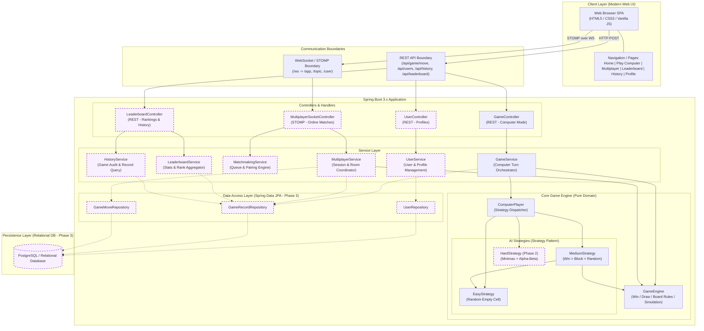
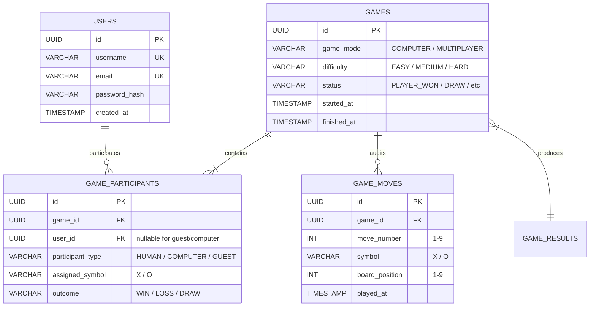
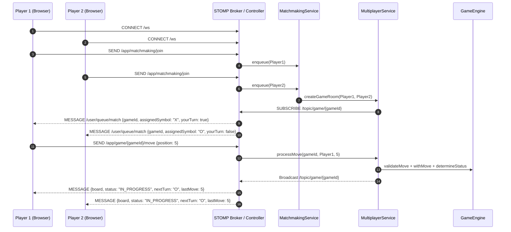

# MVP2 Phase 1: Architecture & Data Model Foundation

## 1. Executive Summary & Assessment of MVP1

The Tic-Tac-Toe application originated as a stateless, single-player web application (MVP1) with:
- **Frontend**: HTML5, Vanilla CSS3, and Vanilla JavaScript submitting turn moves to a REST API.
- **Backend**: Spring Boot 3.4.3 on Java 21, stateless REST endpoint `POST /api/game/move`.
- **Game Engine**: Pure domain logic in `GameEngine` for board validation, winning line detection (3 rows, 3 columns, 2 diagonals), draw detection, and move simulation.
- **AI Opponent**: `ComputerPlayer` providing Easy (uniform random) and Medium (immediate win > immediate block > random fallback) difficulties.
- **Persistence & Security**: None. No database, no user profiles, no WebSocket, and no persistent leaderboards.

Phase 1 safely refactors and establishes the architectural and data model foundations required for the four upcoming capabilities of MVP2:
1. **Hard AI** (Unbeatable Minimax with Alpha-Beta Pruning).
2. **Persistent Leaderboards & History** (Spring Data JPA, PostgreSQL/relational storage, User profiles, immutable game records).
3. **Real-time Online Multiplayer** (WebSocket, STOMP protocol, matchmaking queue, game rooms).
4. **Modern Website UI** (Multi-page responsive layout, navigation, profile screens, leaderboards, interactive game rooms).

---

## 2. Target MVP2 Architecture Diagram



> *Note: Dashed lines and highlighted boxes designate future components explicitly prepared by this architecture but deferred to upcoming phases.*

---

## 3. Why the Architecture is Evolving

1. **Decoupling AI Algorithms from Coordination**:
   In MVP1, `ComputerPlayer` directly embedded both Easy and Medium heuristics inside one monolithic class. Preparing for Minimax requires the **Strategy Pattern** so that complex search trees and alpha-beta evaluations can be implemented and tested independently without bloating the turn orchestrator.
2. **Decoupling Game Engine from Transport**:
   `GameEngine` is the server-authoritative single source of truth for Tic-Tac-Toe rules. Both REST single-player turns and real-time STOMP multiplayer matches must reuse the identical `GameEngine` instance without transport-specific concerns leaking into rule validation.
3. **Preparing for Identity and Statefulness**:
   MVP1 was entirely stateless. Supporting persistent leaderboards, profile statistics, and active multiplayer rooms requires introducing clean domain entities and lifecycle states without breaking the stateless REST endpoint for anonymous guest players.

---

## 4. Game Engine Boundaries & Purity

The `GameEngine` class (`com.tictactoe.engine.GameEngine`) maintains strict architectural isolation:
- **No HTTP or Spring MVC Dependencies**: Accepts and returns pure domain models (`Board`, `GameStatus`, `PlayerSymbol`).
- **No WebSocket Dependencies**: Has no concept of sessions, connection IDs, or STOMP envelopes.
- **No Database / JPA Dependencies**: Works exclusively with in-memory boards.
- **No Client Logic in Frontend**: Winning lines, turn validation, and draw status are authoritatively evaluated on the backend.

---

## 5. AI Strategy Architecture

We introduced the Strategy Pattern under `com.tictactoe.engine.strategy`:

```
MoveStrategy (Interface)
├── EasyStrategy   (Uniform random selection across empty cells)
├── MediumStrategy (1. Computer Win -> 2. Block Player Win -> 3. Random fallback)
└── HardStrategy   (Placeholder; throws UnsupportedOperationException in Phase 1)
```

### Delegation via ComputerPlayer
`ComputerPlayer` acts as the strategy dispatcher. It maintains an `EnumMap<Difficulty, MoveStrategy>` and delegates `chooseMove(Board board, Difficulty difficulty)`:
- `Difficulty.EASY` -> `EasyStrategy`
- `Difficulty.MEDIUM` -> `MediumStrategy`
- `Difficulty.HARD` -> `HardStrategy` (In Phase 1, `GameService` intercepts `Difficulty.HARD` and returns an informative HTTP 400 Bad Request error).
- Backward-compatible helper methods `chooseEasyMove(Board)` and `chooseMediumMove(Board)` are preserved to ensure zero regressions across legacy callers and existing unit tests.

---

## 6. Domain Enums and Core Concepts

1. **`GameMode`**:
   - `COMPUTER`: Single-player human vs AI.
   - `MULTIPLAYER`: Two human players matched over WebSocket.
2. **`PlayerSymbol`**:
   - `X`: First player symbol.
   - `O`: Second player / computer symbol.
   - Includes helpers: `opponent()`, `getValue()`, `fromString(String)`.
3. **`Difficulty`**:
   - `EASY`: Random moves.
   - `MEDIUM`: Rule-based heuristics.
   - `HARD`: Minimax with alpha-beta pruning (Phase 2).
4. **`GameStatus`**:
   Reflects both single-player and multiplayer lifecycles:
   - `WAITING`: Matchmaking lobby awaiting opponent.
   - `MATCHED`: Players paired, initializing game room.
   - `IN_PROGRESS`: Game actively being played.
   - `PLAYER_WON` / `COMPUTER_WON`: Single-player outcomes.
   - `PLAYER_ONE_WON` / `PLAYER_TWO_WON`: Multiplayer outcomes.
   - `DRAW`: 9 moves completed with no 3-in-a-row.
   - `ABANDONED`: Disconnect or forfeit before completion.
   - Includes `isTerminal()` helper to reliably check if a game has concluded.

---

## 7. Future User Profile & Identity Model

### Guest vs Registered User Coexistence
To maintain the instant-play appeal of MVP1, guest play must remain first-class:

| Feature | Guest User | Registered User |
| :--- | :--- | :--- |
| **Play vs Computer** | Instant, no login required | Available |
| **Browser Score Counter** | Stored in memory / `localStorage` | Stored in memory / `localStorage` |
| **Persistent History** | None (ephemeral) | Automatically saved to database |
| **Leaderboard Visibility** | Can view public leaderboards | Can view and rank on leaderboards |
| **Multiplayer Access** | Matchmade as Guest or restricted | Full matchmaking & rated matches |

### Proposed User Entity Design (Phase 3)
```java
@Entity
@Table(name = "users")
public class User {
    @Id
    @GeneratedValue(strategy = GenerationType.UUID)
    private UUID id;

    @Column(nullable = false, unique = true, length = 32)
    private String username;

    @Column(nullable = false, unique = true)
    private String email;

    @Column(nullable = false)
    private String passwordHash; // BCrypt hash

    @Enumerated(EnumType.STRING)
    @Column(nullable = false)
    private UserRole role = UserRole.PLAYER;

    @CreationTimestamp
    @Column(nullable = false, updatable = false)
    private Instant createdAt;

    @UpdateTimestamp
    private Instant updatedAt;
}
```

---

## 8. Future Persistence Model & Data Schema

### Core Principle: Immutable Game Records as Single Source of Truth
Rather than maintaining mutable counter fields on the `User` table (which can become desynchronized upon concurrent writes, rollback failures, or system crashes), **every completed game is recorded as an immutable `GameRecord`**. Statistics and leaderboards are derived from these authoritative records.



---

## 9. Game History Design

The game history view allows users to review past performances:
- **Game Level History (Default)**:
  - Game ID
  - Date / Timestamp
  - Game Mode (`COMPUTER` vs `MULTIPLAYER`)
  - AI Difficulty (if Computer mode)
  - Opponent Name (Computer or Player 2 username)
  - Result (`WIN`, `LOSS`, `DRAW`)
  - Total Duration
- **Move-by-Move Audit (`GAME_MOVES`)**:
  - Captured optionally to enable future match replay or anti-cheat auditing. Stored as an ordered sequence of move positions (1–9) with timestamps.

---

## 10. Leaderboard Design

### Principles
- **No Arbitrary Formulas**: Kept transparent and explainable.
- **Separate Ladders by Game Mode**:
  1. **Multiplayer Leaderboard**: Ranked by total multiplayer wins, win percentage, and total games played.
  2. **Computer Leaderboard (Hard Mode)**: Dedicated ranking for human players beating the unbeatable AI (if any win scenarios or least-loss survival metrics are tracked).
  3. Easy/Medium modes are considered casual practice and do not pollute competitive multiplayer leaderboards.

### Aggregation Query Strategy
Leaderboard queries execute against indexed `GameParticipant` and `GameRecord` tables:
```sql
SELECT 
    u.username,
    COUNT(gp.id) AS games_played,
    COUNT(CASE WHEN gp.outcome = 'WIN' THEN 1 END) AS wins,
    COUNT(CASE WHEN gp.outcome = 'LOSS' THEN 1 END) AS losses,
    COUNT(CASE WHEN gp.outcome = 'DRAW' THEN 1 END) AS draws,
    ROUND(COUNT(CASE WHEN gp.outcome = 'WIN' THEN 1 END) * 100.0 / NULLIF(COUNT(gp.id), 0), 1) AS win_rate
FROM game_participants gp
JOIN games g ON gp.game_id = g.id
JOIN users u ON gp.user_id = u.id
WHERE g.game_mode = 'MULTIPLAYER' AND g.status IN ('PLAYER_ONE_WON', 'PLAYER_TWO_WON', 'DRAW')
GROUP BY u.id, u.username
HAVING COUNT(gp.id) >= 5
ORDER BY wins DESC, win_rate DESC;
```
For high traffic, a read-through cache or materialized view can be refreshed on a scheduled cron without compromising transactional integrity.

---

## 11. Multiplayer Architecture & STOMP Message Contracts

### Overview
Multiplayer games are coordinated via WebSockets using the STOMP protocol:
- **WebSocket Endpoint**: `/ws`
- **Application Destination Prefix**: `/app` (client-to-server messages)
- **Broker Destination Prefixes**: `/topic` (broadcast / room messages), `/user` (private user queues)



### Proposed STOMP Message Contracts
1. **Matchmaking Request**:
   - `SEND /app/matchmaking/join` (Payload: `{ "userId": "...", "mode": "CASUAL" }`)
2. **Match Found Event**:
   - `MESSAGE /user/queue/match`
   - Payload: `{ "gameId": "uuid", "symbol": "X", "opponent": "Player2", "isYourTurn": true }`
3. **Player Move Request**:
   - `SEND /app/game/{gameId}/move`
   - Payload: `{ "position": 5 }`
4. **Game State Broadcast**:
   - `MESSAGE /topic/game/{gameId}`
   - Payload: `{ "board": [...], "status": "IN_PROGRESS", "nextTurn": "O", "lastMove": 5, "winner": null }`
5. **Game Over Broadcast**:
   - `MESSAGE /topic/game/{gameId}`
   - Payload: `{ "board": [...], "status": "PLAYER_ONE_WON", "winner": "X", "winningLine": [0,4,8] }`
6. **Disconnect / Forfeit Event**:
   - `MESSAGE /topic/game/{gameId}`
   - Payload: `{ "status": "ABANDONED", "reason": "Opponent disconnected." }`

---

## 12. REST vs WebSocket Responsibilities

| Responsibility | REST API | WebSocket / STOMP |
| :--- | :--- | :--- |
| **Turn Protocol** | Single-player vs Computer | Real-time Multiplayer |
| **State Maintenance** | Stateless (client supplies board) | Stateful Game Rooms (server tracks match) |
| **Authentication** | Bearer Token / Cookie / Anonymous | Stomp Header Token on `/ws` handshake |
| **Queries** | User Profile, History, Leaderboard | Match updates, live turn indicators, chat |

---

## 13. Modern Website UI Architecture

### Layout & Page Structure
```
+-------------------------------------------------------------------+
|  [Logo] Tic-Tac-Toe Pro     Play Computer  Multiplayer  Ranks  [User] |
+-------------------------------------------------------------------+
|                                                                   |
|   +--------------------------+    +---------------------------+   |
|   |       Game Board         |    |        Match Info         |   |
|   |   +---+---+---+          |    | Player: Human (X)         |   |
|   |   | X | O |   |          |    | Opponent: Computer (O)    |   |
|   |   +---+---+---+          |    | Difficulty: Medium        |   |
|   |   |   | X |   |          |    | Turn: Your turn!          |   |
|   |   +---+---+---+          |    +---------------------------+   |
|   |   |   |   | O |          |    |        Scoreboard         |   |
|   |   +---+---+---+          |    | Wins: 3  Losses: 1 Draws: 2|  |
|   +--------------------------+    +---------------------------+   |
|                                                                   |
+-------------------------------------------------------------------+
|  (C) 2026 Tic-Tac-Toe Pro | Privacy | Documentation | GitHub     |
+-------------------------------------------------------------------+
```

### Planned Navigation & Views
1. **Home / Play vs Computer**:
   - Difficulty picker (Easy, Medium, Hard).
   - Interactive 3x3 board with smooth hover and placement animations.
   - Session scoreboard.
2. **Multiplayer Arena**:
   - "Find Match" quick queue button.
   - Live waiting spinner and matched opponent notification.
   - Real-time interactive board with opponent turn indicator and timer.
3. **Leaderboards**:
   - Filterable table: Global, Weekly, Multiplayer, Hard Mode.
   - Ranks, avatars, win rates, and streak indicators.
4. **Match History**:
   - Historical game records with outcomes and dates.
5. **Profile Screen**:
   - Player statistics, achievements, member join date, and settings.

---

## 14. Architectural Decision Records (ADRs)

### ADR 1: Decouple Game Engine from HTTP & Web Transport
- **Decision**: `GameEngine` contains purely deterministic board rules and has zero knowledge of Spring controllers, HTTP requests, or WebSocket channels.
- **Rationale**: Enables identical rule enforcement across single-player REST, multiplayer STOMP, and headless unit tests.

### ADR 2: Strategy Pattern for Computer AI Difficulties
- **Decision**: AI moves are encapsulated behind `MoveStrategy` implementations (`EasyStrategy`, `MediumStrategy`, `HardStrategy`), coordinated by `ComputerPlayer`.
- **Rationale**: Keeps controllers completely unaware of move calculation details and allows Minimax with alpha-beta pruning to be cleanly added in Phase 2.

### ADR 3: REST Remains the Communication Protocol for Computer Games
- **Decision**: Single-player vs Computer continues using `POST /api/game/move`.
- **Rationale**: WebSockets add unnecessary stateful connection overhead for single-player games. The stateless REST API is fast, simple, and backwards-compatible with MVP1.

### ADR 4: WebSocket with STOMP for Real-Time Multiplayer
- **Decision**: Use Spring WebSocket with STOMP broker for two-player matchmaking and game rooms.
- **Rationale**: STOMP provides pub/sub topics (`/topic/game/{id}`), point-to-point user queues (`/user/queue`), and message framing without custom wire protocols.

### ADR 5: Immutable Game Records as Source of Truth for Leaderboards
- **Decision**: Leaderboards and player stats are derived from completed `GameRecord` entries rather than mutable counters on the user model.
- **Rationale**: Guarantees auditability and prevents counter drift from race conditions or failed transactions.

### ADR 6: Strict Backward Compatibility for MVP1
- **Decision**: All MVP1 endpoints, request payloads, board formats (1–9 positions, 0–8 indices), and session scores must remain fully functional.
- **Rationale**: Continuous delivery without breaking existing clients or test suites.

### ADR 7: Hard AI Deferred to Phase 2
- **Decision**: `HardStrategy` is registered as a strategy placeholder but throws `UnsupportedOperationException` if invoked, and `GameService` returns a 400 Bad Request if requested in Phase 1.
- **Rationale**: Avoids partial, broken, or fake Hard AI until full Minimax with alpha-beta pruning is comprehensively developed and tested in Phase 2.

---

## 15. Security & Server Authoritative Principles

1. **Server Authority**:
   - The frontend is strictly a rendering layer. The server validates every move, verifies that the targeted cell is unoccupied, detects winning combinations, and declares draws.
2. **Turn Ordering & Symbol Ownership**:
   - In multiplayer, the server enforces turn alternation and confirms that the message sender's session owns the active symbol (`X` or `O`).
3. **Input Sanitization**:
   - Board positions must be integers between 1 and 9. Malformed symbols, irregular board lengths, or unexpected payloads are rejected with HTTP 400.
4. **Anti-Tampering for Leaderboards**:
   - Clients cannot submit match results directly. Only the server can commit completed `GameRecord` instances upon terminal game evaluations.

---

## 16. What is Intentionally NOT Implemented in Phase 1

To preserve focus and maintain clean incremental delivery:
1. **Minimax & Alpha-Beta Pruning**: Deferred to **Phase 2**.
2. **Spring Data JPA, Hibernate, and Relational Database Schema**: Deferred to **Phase 3**.
3. **Spring WebSocket, STOMP Endpoints, and Matchmaking Queues**: Deferred to **Phase 4**.
4. **Full Website Redesign, Navbar, and Multi-View UI**: Deferred to **Phase 5**.
