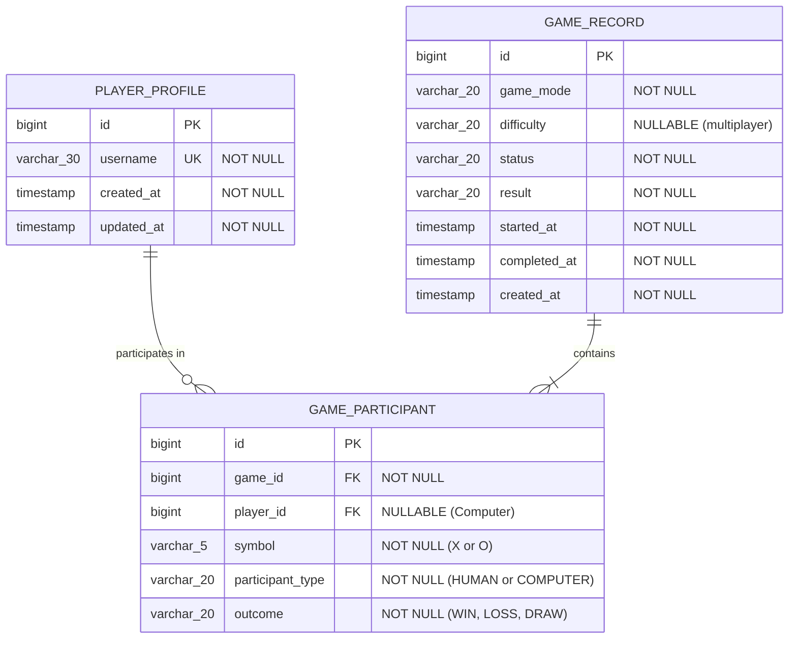

# TIC-TAC-TOE MVP2 — PHASE 3 DOCUMENTATION
## Spring Data JPA, Relational Persistence, User Profiles, Game History & Leaderboards

---

## 1. Executive Summary

Phase 3 introduces relational database persistence to the Tic-Tac-Toe MVP2 project. Prior to Phase 3, the application was entirely stateless: player moves and outcomes evaporated immediately upon game conclusion or server restart. 

In Phase 3:
- **Spring Data JPA** was integrated into the Spring Boot backend with **PostgreSQL** production compatibility and an embedded **H2** development/testing mode for zero-friction setup.
- **Player Profiles** (`PlayerProfile`) were created to persist player identity with unique username constraints and automatic timestamp auditing.
- **Game Records** (`GameRecord`) and **Game Participants** (`GameParticipant`) were modeled to persist server-authoritative match outcomes for computer games while maintaining direct schema compatibility with future multiplayer games (Phase 4).
- **Core Game Engine Independence** was strictly preserved: `GameEngine`, `Board`, and AI strategies (`EasyStrategy`, `MediumStrategy`, `HardStrategy`) contain zero JPA annotations or database dependencies.
- **Server-Authoritative Game Persistence**: Game outcomes are determined exclusively on the backend and saved transactionally when a registered player concludes a match.
- **Guest vs. Registered Gameplay**: Anonymous guest gameplay (MVP1 style) remains 100% functional with zero database writes.
- **User Profile, Game History, and Leaderboard REST APIs** were introduced with pagination, explainable win rate calculations, and safe zero-division handling.

---

## 2. Database Technology & Configuration

### 2.1 Database Selection
- **Production Target**: **PostgreSQL** via `org.postgresql:postgresql` runtime driver. Suitable for scalable, transactional, concurrent multi-user persistence.
- **Development & Automated Testing**: **H2 In-Memory Database** running in PostgreSQL compatibility mode (`MODE=PostgreSQL;DB_CLOSE_DELAY=-1;DB_CLOSE_ON_EXIT=FALSE`).
  - Developers and automated CI test suites run without requiring a pre-installed or running PostgreSQL daemon.
  - H2 console is enabled locally at `/h2-console` for quick schema and table inspection.

### 2.2 Configuration Properties (`application.properties`)
```properties
# Datasource configuration with environment variable overrides
spring.datasource.url=${SPRING_DATASOURCE_URL:jdbc:h2:mem:tictactoedb;DB_CLOSE_DELAY=-1;DB_CLOSE_ON_EXIT=FALSE;MODE=PostgreSQL}
spring.datasource.driverClassName=${SPRING_DATASOURCE_DRIVER:org.h2.Driver}
spring.datasource.username=${SPRING_DATASOURCE_USERNAME:sa}
spring.datasource.password=${SPRING_DATASOURCE_PASSWORD:}

# JPA & Hibernate configuration
spring.jpa.hibernate.ddl-auto=${SPRING_JPA_HIBERNATE_DDL_AUTO:update}
spring.jpa.show-sql=${SPRING_JPA_SHOW_SQL:false}
spring.jpa.properties.hibernate.format_sql=true
spring.jpa.open-in-view=false

# H2 Console for local development
spring.h2.console.enabled=true
spring.h2.console.path=/h2-console
spring.h2.console.settings.web-allow-others=false
```

---

## 3. Entity-Relationship (ER) Architecture

The schema cleanly isolates the human player identity from the game execution and logical participants:



### 3.1 Design Decisions
1. **Entity Name `PlayerProfile` vs `User`**:
   - In SQL standard and PostgreSQL, `USER` is a reserved keyword that requires quoted identifiers (`"user"`), often causing subtle dialect and migration bugs.
   - `PlayerProfile` cleanly conveys domain intent and prevents namespace clashes with Spring Security.
2. **Participant Modeling (`GameParticipant`)**:
   - Rather than embedding `player1_id` and `player2_id` directly in `GameRecord`, `GameParticipant` creates a normalized join entity.
   - For Player vs Computer matches, the Computer is represented with `participantType = COMPUTER` and `player_id = NULL`. This completely avoids polluting the user table with synthetic computer accounts.
   - For future Phase 4 multiplayer games, two human `GameParticipant` rows (`player1` as `X`, `player2` as `O`) map naturally without schema changes.
3. **Move History Decision**:
   - Detailed move-by-move replay was not requested in Phase 3. Storing move coordinates in a `GameMove` entity would introduce unnecessary schema overhead without added value at this stage.
   - Game records preserve all essential metadata: participants, difficulty, server-calculated result, individual outcome, and start/completion timestamps.

---

## 4. Layered Architecture & Separation of Concerns

The architecture adheres strictly to layered boundaries:

```
[Client / Frontend]
        |
   (HTTP / JSON)
        v
[Controller Layer]
  - GameController
  - UserController
  - LeaderboardController
        |
        v
[Service Layer]
  - GameService (Game turn coordination)
  - GameHistoryService (Game persistence & user history)
  - PlayerProfileService (User creation & profile lookup)
  - LeaderboardService (Aggregate statistics & ranking)
      /             \
     v               v
[Domain Engine]     [Persistence Layer]
  - GameEngine        - PlayerProfileRepository
  - Board             - GameRecordRepository
  - MoveStrategy      - GameParticipantRepository
    (Easy/Med/Hard)           |
                              v
                      [Relational DB (PostgreSQL / H2)]
```

### Strict GameEngine Decoupling
- `GameEngine`, `Board`, `ComputerPlayer`, and the strategy classes (`EasyStrategy`, `MediumStrategy`, `HardStrategy`) remain **100% pure Java** with zero Spring Data or JPA imports.
- `GameService` orchestrates game rules via `GameEngine`. Only upon detecting a terminal state (`PLAYER_WON`, `COMPUTER_WON`, `DRAW`) does `GameService` invoke `GameHistoryService` if `userId` is non-null.

---

## 5. Server Authority & Persistence Flow

Under no circumstances does the server accept game outcome, winner, or score declarations from the client.

### Move Progression Flow
1. Client sends `POST /api/game/move` with:
   - `board`: current 9-cell board list
   - `move`: player's intended position (1-9)
   - `difficulty`: `EASY`, `MEDIUM`, or `HARD`
   - `userId`: (optional) registered player ID
   - `startedAt`: (optional) timestamp when match started
2. `GameService` authoritative validation:
   - Validates board structure, character legality, and turn counts.
   - Validates player move legality.
   - Applies move `'X'`.
3. Terminal Check 1:
   - If player wins or board is full, game ends immediately.
4. Computer AI Move:
   - If in progress, selects optimal move (`EasyStrategy`, `MediumStrategy`, or Minimax `HardStrategy`).
   - Applies move `'O'`.
5. Terminal Check 2:
   - Checks if computer wins or board is full.
6. Persistence Trigger:
   - If game reached a terminal state (`PLAYER_WON`, `COMPUTER_WON`, `DRAW`) and `userId != null`:
     - Invokes `GameHistoryService.recordCompletedComputerGame(...)`.
     - Transactionally writes `GameRecord` and both `GameParticipant` rows with server-verified outcomes.
   - If `userId == null` (Guest Play), no persistence occurs.
7. Return authoritative `GameResponse` to client.

---

## 6. Guest vs. Registered Gameplay

| Feature | Guest Player | Registered Player |
| :--- | :--- | :--- |
| **Play vs Computer (Easy, Medium, Hard)** | Supported | Supported |
| **Client In-Memory Session Score** | Yes | Yes |
| **Persistent User Profile** | No | Yes (`PlayerProfile`) |
| **Completed Game History Saved** | No (zero DB writes) | Yes (`GameRecord`) |
| **Personal Match History Retrieval** | No | Yes (`GET /api/users/{id}/history`) |
| **Leaderboard Participation** | Excluded | Included (`GET /api/leaderboard`) |

---

## 7. Leaderboard & Statistics Calculation

### 7.1 Single Source of Truth
Leaderboard statistics are calculated directly from persistent completed games (`GameParticipant` join records) using aggregate queries:
- **Eligible Games**: Only terminal games (`PLAYER_WON`, `COMPUTER_WON`, `DRAW`) associated with registered players.
- Incomplete, abandoned, or guest games are completely excluded.

### 7.2 Win Rate Formula
$$\text{winRate} = \begin{cases} \dfrac{\text{wins}}{\text{completed games}} \times 100 & \text{if completed games} > 0 \\ 0.0 & \text{if completed games} = 0 \end{cases}$$

- Handled safely using `BigDecimal.setScale(1, RoundingMode.HALF_UP)` to avoid divide-by-zero errors.
- Players with zero games are displayed with `0` games played, `0` wins, `0` losses, `0` draws, and `0.0%` win rate.

### 7.3 Ranking & Tie-Breaking
Leaderboard ranking orders players by:
1. `wins` DESC (Primary ranking)
2. `winRate` DESC (Secondary tie-breaker)
3. `gamesPlayed` DESC (Activity tie-breaker)
4. `username` ASC (Deterministic alphabetical tie-breaker)

---

## 8. REST API Specification

### 8.1 User Profile Endpoints

#### `POST /api/users`
- **Description**: Registers a new player profile.
- **Request Body**:
  ```json
  {
    "username": "neo_matrix"
  }
  ```
- **Validation**: 3-30 characters, alphanumeric and underscores only (`^[a-zA-Z0-9_]{3,30}$`).
- **Responses**:
  - `201 Created`: User profile created.
    ```json
    {
      "id": 1,
      "username": "neo_matrix",
      "createdAt": "2026-09-18T03:00:00Z",
      "updatedAt": "2026-09-18T03:00:00Z"
    }
    ```
  - `400 Bad Request`: Validation error or blank username.
  - `409 Conflict`: Username already exists (`USERNAME_ALREADY_EXISTS`).

#### `GET /api/users/{id}`
- **Description**: Retrieves player profile by ID.
- **Responses**:
  - `200 OK`: Profile found.
  - `404 Not Found`: User does not exist (`NOT_FOUND`).

#### `GET /api/users/by-username/{username}`
- **Description**: Retrieves player profile by username (case-insensitive).
- **Responses**:
  - `200 OK`: Profile found.
  - `404 Not Found`: User does not exist (`NOT_FOUND`).

#### `GET /api/users/{id}/history`
- **Description**: Retrieves paginated match history for the specified user.
- **Query Parameters**:
  - `page`: 0-based page index (default: `0`)
  - `size`: page size (default: `20`, max: `100`)
- **Responses**:
  - `200 OK`: Paginated list of game history items:
    ```json
    {
      "content": [
        {
          "gameId": 101,
          "gameMode": "COMPUTER",
          "difficulty": "HARD",
          "status": "PLAYER_WON",
          "result": "PLAYER_WIN",
          "outcome": "WIN",
          "opponent": "Computer",
          "startedAt": "2026-09-18T03:05:00Z",
          "completedAt": "2026-09-18T03:05:42Z",
          "durationSeconds": 42
        }
      ],
      "pageable": { ... },
      "totalElements": 1,
      "totalPages": 1
    }
    ```
  - `404 Not Found`: User does not exist.

---

### 8.2 Leaderboard Endpoints

#### `GET /api/leaderboard`
- **Description**: Retrieves ranked player leaderboard based on persistent completed games.
- **Query Parameters**:
  - `limit`: maximum entries to return (default: `20`, max: `100`)
- **Responses**:
  - `200 OK`:
    ```json
    [
      {
        "rank": 1,
        "userId": 1,
        "username": "neo_matrix",
        "gamesPlayed": 10,
        "wins": 8,
        "losses": 1,
        "draws": 1,
        "winRate": 80.0
      },
      {
        "rank": 2,
        "userId": 2,
        "username": "morpheus",
        "gamesPlayed": 6,
        "wins": 3,
        "losses": 1,
        "draws": 2,
        "winRate": 50.0
      }
    ]
    ```

---

### 8.3 Gameplay Endpoint (Updated)

#### `POST /api/game/move`
- **Payload**:
  ```json
  {
    "board": ["X", "X", "", "O", "O", "", "", "", ""],
    "position": 3,
    "difficulty": "HARD",
    "userId": 1,
    "startedAt": "2026-09-18T03:05:00Z"
  }
  ```
- **Behavior**:
  - If `userId` is omitted, processes turn as an anonymous guest without writing to database.
  - If `userId` is provided and the turn results in a terminal outcome, server automatically persists the completed game record.

---

## 9. Security & Authentication Scope

> [!WARNING]
> **Identity vs. Authentication**:
> In Phase 3, we implement a **lightweight player identity model** without full cryptographic authentication.
> Clients provide `username` for registration and supply `userId` when initiating or completing games.
>
> **Limitations in Phase 3**:
> 1. No password or credential storage (no plaintext passwords exist).
> 2. No session tokens, JWTs, or OAuth integration.
> 3. An attacker could theoretically supply another user's `userId` in `MoveRequest` to record games against their history.
>
> **Production Roadmap**:
> In future production hardening, an authentication layer (e.g. BCrypt-hashed passwords or session tokens) can be layered seamlessly on top of `PlayerProfile` without modifying the game persistence entities.

---

## 10. Automated Test Results

The backend contains **122 automated tests** across 12 test classes covering domain models, engine rules, AI strategies, repository queries, service logic, controller endpoints, and full integration persistence.

| Test Class | Category | Test Count | Status |
| :--- | :--- | :--- | :--- |
| `DomainModelTest` | Unit | 4 | **PASSED** |
| `EasyStrategyTest` | Unit | 5 | **PASSED** |
| `MediumStrategyTest` | Unit | 5 | **PASSED** |
| `HardStrategyTest` | Unit (Minimax + Alpha-Beta) | 13 | **PASSED** |
| `ComputerPlayerTest` | Unit | 10 | **PASSED** |
| `GameEngineTest` | Unit | 30 | **PASSED** |
| `GameServiceTest` | Unit | 10 | **PASSED** |
| `PlayerProfileServiceTest` | Service Unit | 5 | **PASSED** |
| `GameHistoryServiceTest` | Service Unit | 6 | **PASSED** |
| `LeaderboardServiceTest` | Service Unit | 2 | **PASSED** |
| `PlayerProfileRepositoryTest`| Data JPA Integration | 3 | **PASSED** |
| `GameRecordRepositoryTest` | Data JPA Integration | 1 | **PASSED** |
| `GameParticipantRepositoryTest` | Data JPA Integration | 1 | **PASSED** |
| `UserControllerTest` | Web MVC / Full Integration | 6 | **PASSED** |
| `LeaderboardControllerTest`| Web MVC / Full Integration | 1 | **PASSED** |
| `GameControllerTest` | Controller Integration | 17 | **PASSED** |
| `GamePersistenceIntegrationTest` | End-to-End Integration | 2 | **PASSED** |
| `TicTacToeApplicationTests` | Context Boot | 1 | **PASSED** |
| **Total** | | **122** | **100% PASSED** |

---

## 11. Explicit Scope Verification

- [x] Spring Data JPA integrated and configured.
- [x] Relational database persistence implemented (PostgreSQL-ready + H2 development/test).
- [x] User profiles created with unique username constraints.
- [x] Completed game records persistently saved.
- [x] Game history API implemented with pagination.
- [x] Leaderboard API implemented with dynamic statistics.
- [x] Core `GameEngine` remains 100% decoupled from JPA.
- [x] Hard Minimax with alpha-beta pruning preserved and passing all tests.
- [x] Easy and Medium strategies preserved.
- [x] REST computer gameplay remains server-authoritative.
- [x] **NO WebSocket / STOMP** implemented (deferred to Phase 4).
- [x] **NO Matchmaking / Multiplayer rooms** implemented (deferred to Phase 4).
- [x] **NO complete modern website redesign** implemented (deferred to Phase 5).
