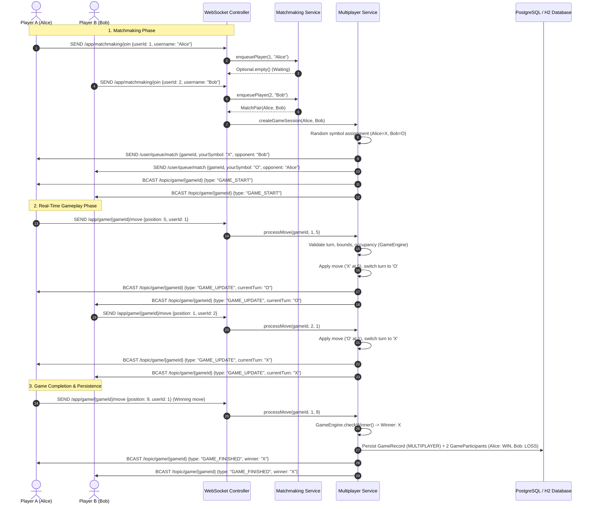

# Phase 4: Online Multiplayer with WebSocket + STOMP

## 1. Overview & Objectives

Phase 4 introduces real-time online multiplayer Player vs Player (PvP) gameplay to Tic-Tac-Toe MVP2 using Spring WebSocket and STOMP messaging.

The design strictly separates:
- **REST Computer Gameplay**: Unchanged stateless REST architecture supporting Easy, Medium, and Hard (Minimax with alpha-beta pruning) difficulties.
- **WebSocket Multiplayer**: Event-driven real-time STOMP messaging managing matchmaking, active game sessions, synchronized turn execution, and server-authoritative win/draw detection.

```
                      Browser Client
                            |
           +----------------+----------------+
           |                                 |
         REST                            WebSocket
      (Computer)                          (STOMP)
           |                                 |
           v                                 v
     GameController           MultiplayerWebSocketController
           |                                 |
           v                                 v
      GameService                    MultiplayerService
           |                           /            \
           |             MatchmakingService   MultiplayerGameSession
           \                     /                   |
            +---------+---------+                    v
                      |                         GameEngine
                      v                              |
                   Database                          v
           (GameRecord / Leaderboard)             Database
```

---

## 2. WebSocket & STOMP Configuration

- **Configuration Class**: `com.tictactoe.config.WebSocketConfig`
- **Transport Endpoints**:
  - Native WebSocket: `/ws` (allowed origin patterns: `*`)
  - SockJS Fallback: `/ws` (with `.withSockJS()`)
- **Handshake Handler**: `CustomHandshakeHandler` assigning a unique `Principal` to every anonymous WebSocket connection, enabling Spring's `SimpMessagingTemplate.convertAndSendToUser` to target private sessions.
- **Application Destination Prefix**: `/app` (routes client messages to `@MessageMapping` handlers).
- **User Destination Prefix**: `/user` (routes private responses to targeted clients).
- **Message Broker**: Spring in-memory simple broker serving `/topic` (broadcast channels) and `/queue` (user-specific channels).

---

## 3. STOMP Destinations

### Client -> Server (`/app`)
| Destination | Payload | Description |
| :--- | :--- | :--- |
| `/app/matchmaking/join` | `JoinMatchmakingRequest` | Player enters the matchmaking waiting queue. |
| `/app/matchmaking/leave` | `LeaveMatchmakingRequest` | Player cancels/exits matchmaking. |
| `/app/game/{gameId}/move` | `MultiplayerMoveRequest` | Player submits a move (position 1–9) for an active match. |

### Server -> Client (`/topic` & `/user/queue`)
| Destination | Type | Description |
| :--- | :--- | :--- |
| `/user/queue/match` | Private | Notifies player when paired (`MATCH_FOUND`), assigned symbol (`X` or `O`), opponent info, and starting board. |
| `/user/queue/errors` | Private | Delivers structured errors (`NOT_YOUR_TURN`, `INVALID_MOVE`, `ALREADY_IN_MATCHMAKING`). |
| `/topic/game/{gameId}` | Broadcast | Broadcasts game state updates (`GAME_START`, `GAME_UPDATE`, `GAME_FINISHED`, `GAME_ABANDONED`). |
| `/topic/match/{userId}` | Broadcast | Fallback user destination for testing clients. |

---

## 4. Message Contracts (DTOs)

All WebSocket communication uses dedicated DTOs; JPA entities are never passed across WebSockets:

1. **`JoinMatchmakingRequest`**:
   ```json
   { "userId": 1, "username": "Alice" }
   ```
2. **`LeaveMatchmakingRequest`**:
   ```json
   { "userId": 1 }
   ```
3. **`MultiplayerMoveRequest`**:
   ```json
   { "position": 5, "userId": 1 }
   ```
4. **`MatchFoundMessage`**:
   ```json
   {
     "type": "MATCH_FOUND",
     "gameId": "b182d8c3-4d43-4e63-b8ad-0ef18d8e3b1c",
     "yourSymbol": "X",
     "opponentUsername": "Bob",
     "currentTurn": "X",
     "board": ["", "", "", "", "", "", "", "", ""],
     "status": "IN_PROGRESS"
   }
   ```
5. **`GameStateMessage`**:
   ```json
   {
     "type": "GAME_UPDATE",
     "gameId": "b182d8c3-4d43-4e63-b8ad-0ef18d8e3b1c",
     "board": ["", "", "", "", "X", "", "", "", ""],
     "currentTurn": "O",
     "status": "IN_PROGRESS",
     "message": "Move accepted. Bob's turn (O).",
     "lastMovePosition": 5,
     "lastMovePlayer": "X",
     "winner": null,
     "winningLine": null
   }
   ```
6. **`WebSocketErrorMessage`**:
   ```json
   {
     "errorCode": "INVALID_MOVE",
     "errorMessage": "Position 5 is already occupied by 'X'.",
     "timestamp": "2026-09-18T03:30:00Z"
   }
   ```
7. **`PlayerDisconnectedMessage`**:
   ```json
   {
     "type": "PLAYER_DISCONNECTED",
     "gameId": "b182d8c3-4d43-4e63-b8ad-0ef18d8e3b1c",
     "message": "Opponent disconnected. The game has been marked as abandoned."
   }
   ```

---

## 5. Matchmaking System

- **Class**: `com.tictactoe.service.MatchmakingService`
- **Queue Type**: In-memory FIFO queue (`ConcurrentLinkedQueue<WaitingPlayer>`).
- **Duplicate Prevention**: `ConcurrentHashMap<Long, WaitingPlayer>` prevents a player from queuing multiple times; throws `ALREADY_IN_MATCHMAKING`.
- **Cancellation**: `leaveQueue(userId)` removes player from queue.
- **Disconnect Cleanup**: `removeBySessionId(sessionId)` automatically purges disconnected sessions.
- **Instance Local**: Matchmaking is instance-local (MVP2 architecture).

---

## 6. Runtime Game Sessions & Concurrency Control

- **Class**: `com.tictactoe.model.MultiplayerGameSession`
- **Registry**: `ConcurrentHashMap<String, MultiplayerGameSession>` in `MultiplayerService`.
- **Synchronization**: `applyMove(...)` is `synchronized` per session instance.
- **Race Condition Prevention**: If two players submit moves concurrently, or if a player sends double moves:
  - Moves are serialized by the monitor lock.
  - The first move applies and updates `currentTurn`.
  - The second move is evaluated against the updated turn and rejected immediately with `InvalidMoveException("It is not your turn")` or `"already occupied"`.
  - The board state is never corrupted.

---

## 7. Server Authority & GameEngine Reuse

- The frontend never evaluates moves, turns, or wins.
- Move legality is verified using `GameEngine.validateMove(board, position)`.
- Moves are applied using immutable board transformations: `board = board.withMove(index, symbol)`.
- Win evaluation: `gameEngine.checkWinner(board, symbol)`.
- Draw evaluation: `board.isFull()`.
- Winning line detection extracts the exact 3-in-a-row coordinates (1-based) from `GameEngine.WINNING_COMBINATIONS` for UI highlighting.

---

## 8. Persistence & Leaderboard Integration

Completed multiplayer matches are saved to the Phase 3 schema:
- **`GameRecord`**:
  - `gameMode`: `GameMode.MULTIPLAYER`
  - `difficulty`: `null` (multiplayer is human vs human)
  - `status`: `PLAYER_ONE_WON` / `PLAYER_TWO_WON` / `DRAW`
  - `result`: `PLAYER_ONE_WIN` / `PLAYER_TWO_WIN` / `DRAW`
  - `startedAt`, `completedAt`
- **`GameParticipant`**:
  - Player X: `PlayerSymbol.X`, `ParticipantType.HUMAN`, `outcome` (`WIN` / `LOSS` / `DRAW`)
  - Player O: `PlayerSymbol.O`, `ParticipantType.HUMAN`, `outcome` (`LOSS` / `WIN` / `DRAW`)
- **Leaderboard Calculation**:
  - Winner: +1 win, +1 games played
  - Loser: +1 loss, +1 games played
  - Draw: +1 draw for each player, +1 games played
- **History**:
  - Appears in `/api/users/{id}/history` with opponent username and outcome.

---

## 9. Disconnect & Abandonment Policy

- **Listener**: `com.tictactoe.listener.WebSocketEventListener` listening to Spring's `SessionDisconnectEvent`.
- **Waiting in Queue**: Purged immediately from the queue.
- **Active Game**:
  - If a game is in progress, the session transitions to `GameStatus.ABANDONED`.
  - Opponent is notified via `PlayerDisconnectedMessage` and `GameStateMessage(GAME_ABANDONED)`.
  - Abandoned games are closed without crediting wins/losses to prevent ranking abuse.

---

## 10. Sequence Diagram



---

## 11. Known Scalability Limitations

1. **In-Memory Broker**: Uses Spring's built-in simple broker. In a multi-instance production cluster, an external broker (e.g. RabbitMQ with STOMP plugin) would be required to broadcast game events across application nodes.
2. **Instance-Local Sessions & Queue**: Matchmaking and active session maps are stored in memory (`ConcurrentHashMap`). In a distributed architecture, sessions and matchmaking queues would be distributed via Redis or dedicated matchmaking clusters.
3. **Authentication**: Uses client-supplied `userId` with custom WebSocket `Principal` assignment. External OAuth/JWT authentication is deferred to future production security hardening.
